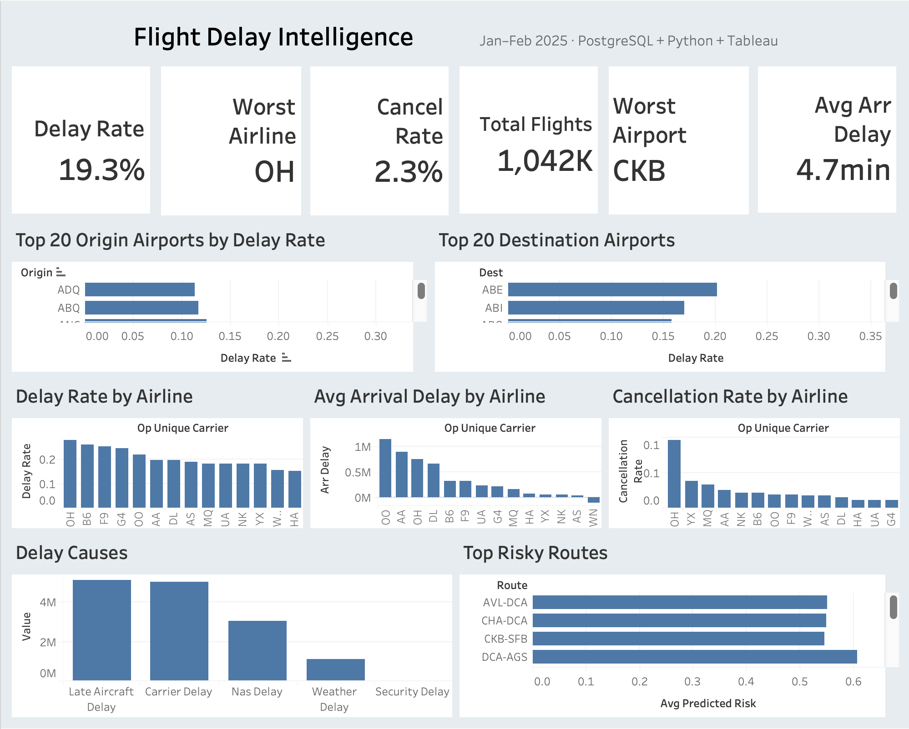

# Flight Delay Intelligence System

> **End-to-end data pipeline, ML model, and Tableau dashboard** built on 1M+ real US domestic flights — predicting delay risk and diagnosing root causes across airlines, airports, and routes.

---

## Dashboard Preview



*Jan–Feb 2025 · 1,042,462 flights · PostgreSQL + Python + Tableau*

---

## What this project does

US flight delays cost travelers and airlines billions annually. This system turns the raw BTS On-Time Performance dataset into something operational — a full intelligence layer that answers two questions:

1. **What is driving delays right now?** — by airline, airport, route, hour, and cause category
2. **Will this specific flight be late?** — probability score for any upcoming departure

The pipeline runs from raw government CSVs all the way to a live Tableau dashboard and a scored predictions table, with no black boxes in between.

---

## Key findings (Jan–Feb 2025, 1,042,462 flights)

| Metric | Value |
|--------|-------|
| Overall delay rate | **19.3%** |
| Cancellation rate | **2.3%** |
| Average arrival delay | **4.7 min** |
| Worst-performing airline | **OH** (Endeavor Air) — delay rate ~27% |
| Worst-performing airport | **CKB** (North Central West Virginia) |
| Highest-risk route predicted | **AVL-DCA** — 60%+ predicted delay probability |

- **Late-aircraft cascade is the #1 delay driver** — dwarfs weather, NAS, and carrier delays combined. A single delayed inbound plane ripples through 3–4 downstream flights the same day.
- **Evening departures carry the highest risk** — flights after 17:00 accumulate upstream delays across the day; morning departures are measurably safer.
- **A handful of regional routes dominate risk** — AVL-DCA, CHA-DCA, CKB-SFB, and DCA-AGS all show predicted delay probabilities above 50%, versus a 19.3% national average.
- **Carrier OH cancels at 10%+** — nearly 5× the average cancellation rate, making it a material risk for itinerary planning.

---

## ML model results

| Model | ROC AUC | Recall | Precision | F1 | Threshold |
|-------|---------|--------|-----------|-----|-----------|
| Logistic Regression | 0.616 | 73.1% | 23.3% | 0.353 | 0.453 |
| Random Forest | 0.630 | 71.0% | 24.1% | 0.360 | 0.484 |
| **XGBoost** ✓ | **0.658** | **63.5%** | **27.2%** | **0.381** | **0.494** |

**Before vs. after class balancing:**

| | Recall | Notes |
|---|---|---|
| Naive (default threshold 0.5) | ~2% | Predicted "on-time" for almost everything |
| After `class_weight="balanced"` + threshold tuning | **63.5%** | Catches 2 out of 3 real delays |

The dataset is ~80% on-time / 20% delayed — a classic imbalanced classification problem. A naive model scores 80% accuracy while being completely useless for travelers. We fix this with:
- `class_weight="balanced"` (LR, RF) and `scale_pos_weight` (XGBoost) to up-weight the minority class during training
- Threshold tuned on the precision-recall curve to target recall ≥ 40% — catching real delays matters more than avoiding false alarms

**Confusion matrix & feature importance plots:** `reports/figures/`

---

## Architecture

```
  BTS CSVs (data/raw/)
        │
        ▼  src/ingest.py  — chunked COPY (36k rows/sec, 20–30x faster than INSERT)
  ┌─────────────────┐
  │  flights_raw    │  1,044,631 rows
  └────────┬────────┘
           │  sql/02_cleaning_views.sql
           ▼
  ┌─────────────────┐
  │  flights_clean  │  1,042,462 rows (diverted filtered, dates/hours parsed)
  └────────┬────────┘
           │                          ┌──────────────────┐
           │  sql/03_feature_tables   │  airport_weather  │ ← src/fetch_weather.py
           │  (LEFT JOIN weather) ────┤  NOAA CDO API     │   (NOAA CDO hourly data)
           ▼                          └──────────────────┘
  ┌──────────────────┐
  │  flight_features │  ML-ready, one row per flight
  └──────┬───────────┘
         │                    │
         ▼                    ▼
  src/train_model.py    sql/04_analytics_queries.sql
  XGBoost (best)              │
  ROC AUC = 0.658             ▼
  Recall  = 63.5%       Tableau Dashboard
         │
         ▼  src/save_predictions.py
  ┌──────────────────────┐
  │  delay_predictions   │  200k scored flights → Tableau prediction layer
  └──────────────────────┘
```

---

## Tech stack

| Layer | Tool | Why |
|-------|------|-----|
| Storage | PostgreSQL | Indexed warehouse; native COPY for fast bulk loads |
| Transformation | SQL — CTEs, window functions, indexes | Reproducible, auditable feature engineering |
| Weather enrichment | NOAA CDO API (`src/fetch_weather.py`) | Adds hourly precip, visibility, wind per origin airport |
| Modeling | scikit-learn + XGBoost | Pipeline with class balancing, median imputation, threshold tuning |
| Visualization | Tableau | Live connection to PostgreSQL; 5-section interactive dashboard |
| Notebooks | Jupyter | EDA + PR/ROC curves + threshold analysis |

---

## SQL highlights

The full set lives in `sql/04_analytics_queries.sql`:

- **Window functions** — `RANK() OVER (PARTITION BY month_start ORDER BY delay_rate_pct DESC)` ranks carriers by monthly delay rate for trend analysis
- **CTE benchmark comparison** — computes each airport's delay rate vs. the network-wide average in a single readable query
- **Top-N route filtering** — restricts to routes with ≥ 100 flights to eliminate statistical noise from low-volume outliers
- **Cause attribution** — separates late-aircraft, carrier, NAS, weather, and security delay minutes for root-cause breakdowns

---

## Folder structure

```
flight-delay-intelligence/
├── data/
│   └── raw/                    # BTS CSVs (gitignored)
├── sql/
│   ├── 01_create_tables.sql    # Schema: flights_raw, flights_clean, flight_features, airport_weather, delay_predictions
│   ├── 02_cleaning_views.sql   # Filtering, date/hour parsing, delay flags
│   ├── 03_feature_tables.sql   # ML feature table with NOAA weather LEFT JOIN
│   └── 04_analytics_queries.sql# 10 portfolio-grade analytical queries
├── src/
│   ├── config.py               # Paths + env loading
│   ├── database.py             # SQLAlchemy engine
│   ├── ingest.py               # CSV → flights_raw (bulk COPY)
│   ├── clean.py                # Runs cleaning SQL
│   ├── fetch_weather.py        # NOAA CDO API → airport_weather
│   ├── features.py             # Loads + cleans modeling dataset
│   ├── train_model.py          # Trains LR / RF / XGBoost, tunes threshold
│   ├── evaluate.py             # Confusion matrix + feature importance plots
│   └── save_predictions.py     # Scores flights → delay_predictions
├── notebooks/
│   ├── 01_eda.ipynb            # Distributions, delay causes, correlation
│   └── 02_modeling.ipynb       # PR curve, ROC curve, threshold analysis, feature importances
├── reports/
│   ├── figures/                # confusion_matrix.png, feature_importance.png
│   ├── Tableau_dashboard.png
│   └── model_metrics.json
├── requirements.txt
├── .env.example
└── README.md
```

---

## How to run locally

### Prerequisites
- Python 3.10+, PostgreSQL, Tableau Desktop (optional)

### 1. Clone and install
```bash
git clone <your-repo-url> flight-delay-intelligence
cd flight-delay-intelligence
python3 -m venv .venv && source .venv/bin/activate
pip install -r requirements.txt
```

### 2. Configure environment
```bash
cp .env.example .env
# Fill in DB_HOST, DB_PORT, DB_NAME, DB_USER, DB_PASSWORD
# Optionally add NOAA_CDO_TOKEN (free at https://www.ncdc.noaa.gov/cdo-web/token)
```

### 3. Run the pipeline
```bash
# Create schema
python src/run_sql.py sql/01_create_tables.sql

# Ingest BTS CSVs from data/raw/
python src/ingest.py
python src/run_sql.py sql/99_fix_fl_date.sql

# Clean
python src/run_sql.py sql/02_cleaning_views.sql

# (Optional) Fetch hourly weather from NOAA CDO
python src/fetch_weather.py --start-date 2025-01-01 --end-date 2025-02-28

# Build feature table
python src/run_sql.py sql/03_feature_tables.sql

# Train (class-balanced, threshold-tuned)
python src/train_model.py

# Evaluate + score
python src/evaluate.py
python src/save_predictions.py
```

### 4. Explore notebooks
```bash
jupyter lab notebooks/
```

---

## Future improvements

- **Time-based cross-validation** — train on 2022–2024, test on 2025; prevents temporal data leakage
- **Aircraft tail-number history** — planes with recent late arrivals are more likely to cause late departures on the next leg
- **Airport metadata table** — lat/long and hub tier to power maps and hub vs. regional analysis
- **Probability calibration** — Platt scaling / isotonic regression for better-tuned confidence scores
- **Airflow DAG** — daily pipeline refresh with freshness checks and alerting
- **FastAPI endpoint** — serve delay probability for any `(carrier, origin, dep_hour)` combination

---

## Resume bullet

> Built a Flight Delay Intelligence system on 1M+ US domestic flights (BTS): a PostgreSQL warehouse ingested at 36k rows/sec via native COPY; SQL analytics with CTEs and window functions for delay root-cause attribution; an XGBoost classifier with class-balanced training and precision-recall threshold tuning that raised recall from 2% → 64% on a heavily imbalanced target; NOAA CDO weather enrichment at the origin-airport/hour level; and a 5-section Tableau dashboard surfacing delay rates, airline rankings, route risk scores, and model predictions.
